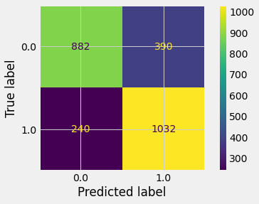

<h1>Table of Contents<span class="tocSkip"></span></h1>
<div class="toc"><ul class="toc-item"><li><span><a href="#Tel-Co.-Churn-Analysis" data-toc-modified-id="Tel-Co.-Churn-Analysis-1"><span class="toc-item-num">1&nbsp;&nbsp;</span>Tel Co. Churn Analysis</a></span><ul class="toc-item"><li><span><a href="#Final-Project-Submission" data-toc-modified-id="Final-Project-Submission-1.1"><span class="toc-item-num">1.1&nbsp;&nbsp;</span>Final Project Submission</a></span></li><li><span><a href="#Business-Understanding" data-toc-modified-id="Business-Understanding-1.2"><span class="toc-item-num">1.2&nbsp;&nbsp;</span>Business Understanding</a></span></li><li><span><a href="#Problem-Statement" data-toc-modified-id="Problem-Statement-1.3"><span class="toc-item-num">1.3&nbsp;&nbsp;</span>Problem Statement</a></span></li></ul></li><li><span><a href="#Objective" data-toc-modified-id="Objective-2"><span class="toc-item-num">2&nbsp;&nbsp;</span>Objective</a></span></li><li><span><a href="#Mission" data-toc-modified-id="Mission-3"><span class="toc-item-num">3&nbsp;&nbsp;</span>Mission</a></span></li><li><span><a href="#EDAs" data-toc-modified-id="EDAs-4"><span class="toc-item-num">4&nbsp;&nbsp;</span>EDAs</a></span><ul class="toc-item"><li><span><a href="#Import-Libraries-and-Dataset-with-Initial-Review" data-toc-modified-id="Import-Libraries-and-Dataset-with-Initial-Review-4.1"><span class="toc-item-num">4.1&nbsp;&nbsp;</span>Import Libraries and Dataset with Initial Review</a></span><ul class="toc-item"><li><span><a href="#Review-of-data-in-each-column" data-toc-modified-id="Review-of-data-in-each-column-4.1.1"><span class="toc-item-num">4.1.1&nbsp;&nbsp;</span>Review of data in each column</a></span></li></ul></li><li><span><a href="#Preprocessing" data-toc-modified-id="Preprocessing-4.2"><span class="toc-item-num">4.2&nbsp;&nbsp;</span>Preprocessing</a></span></li><li><span><a href="#Functions" data-toc-modified-id="Functions-4.3"><span class="toc-item-num">4.3&nbsp;&nbsp;</span>Functions</a></span></li><li><span><a href="#Decision-Trees" data-toc-modified-id="Decision-Trees-4.4"><span class="toc-item-num">4.4&nbsp;&nbsp;</span>Decision Trees</a></span><ul class="toc-item"><li><span><a href="#Change-numeric-columns-to-categories" data-toc-modified-id="Change-numeric-columns-to-categories-4.4.1"><span class="toc-item-num">4.4.1&nbsp;&nbsp;</span>Change numeric columns to categories</a></span></li><li><span><a href="#Attribute-Selection" data-toc-modified-id="Attribute-Selection-4.4.2"><span class="toc-item-num">4.4.2&nbsp;&nbsp;</span>Attribute Selection</a></span></li><li><span><a href="#Decision-Trees-Baseline" data-toc-modified-id="Decision-Trees-Baseline-4.4.3"><span class="toc-item-num">4.4.3&nbsp;&nbsp;</span>Decision Trees Baseline</a></span></li><li><span><a href="#Feature-Selection" data-toc-modified-id="Feature-Selection-4.4.4"><span class="toc-item-num">4.4.4&nbsp;&nbsp;</span>Feature Selection</a></span></li><li><span><a href="#SMOTE" data-toc-modified-id="SMOTE-4.4.5"><span class="toc-item-num">4.4.5&nbsp;&nbsp;</span>SMOTE</a></span></li><li><span><a href="#Best-Decision-Tree" data-toc-modified-id="Best-Decision-Tree-4.4.6"><span class="toc-item-num">4.4.6&nbsp;&nbsp;</span>Best Decision Tree</a></span></li></ul></li><li><span><a href="#Random-Forest" data-toc-modified-id="Random-Forest-4.5"><span class="toc-item-num">4.5&nbsp;&nbsp;</span>Random Forest</a></span><ul class="toc-item"><li><span><a href="#Bagged-Trees" data-toc-modified-id="Bagged-Trees-4.5.1"><span class="toc-item-num">4.5.1&nbsp;&nbsp;</span>Bagged Trees</a></span></li><li><span><a href="#Random-Forest" data-toc-modified-id="Random-Forest-4.5.2"><span class="toc-item-num">4.5.2&nbsp;&nbsp;</span>Random Forest</a></span></li></ul></li><li><span><a href="#Analysis-and-Conclusions" data-toc-modified-id="Analysis-and-Conclusions-4.6"><span class="toc-item-num">4.6&nbsp;&nbsp;</span>Analysis and Conclusions</a></span></li></ul></li></ul></div>

# Tel Co. Churn Analysis


## Final Project Submission

Please fill out:
    
Student name: Joan Leonard Short
Student pace: part-time
Scheduled project review date/time:
Instructor name: Amber Yandow
Blog post URL:

## Business Understanding

'Churn' is a major cost to the telecom industry and is defined as customer loss as a customer moves to a 'better' supplier. 
Most of the costs relate to the initial discounts given to a customer and the initial 
cost of setting up a customer.


There are many factors involved in why a customer leaves: cost, slow to no resolutions of problems etc. but 
the primary reason is a bad experience with the company: outages, bad customer service experience, non-returned 
calls and feeling that they don't matter to the company.

Reasons for leaving are noted below:

Customer Service - 70% - Quality - 30%
Price - 24%
Functionality - 13%
Other 30%

82% of companies claim that retention is cheaper than acquisition and a 2% increase 
in retention could reduce costs by 10%.The average churn rate for the industry is 10% to 60%

## Problem Statement

Churn at Telco is currently 26.%. Churn adds significant costs to the client because of the initial 
discounts given and the high cost of adding a customer

#  Objective

Using the data provided by the client(Telco), the objective is to predict the customers who will 
become 'churn',  meaning that they will disengage with the client and move to another vendor.

<h1>Mission</h1>

Our mission is to obtain, understand and analyze the dataset provided by the client and to use analytical, graphical and statistical means to predict customer churn. This analysis is considered binary classification because the prediction will be binary - churn/no churn.   We have chosen the <span style='background:yellow'>inference method</span> because it is believed that our model does not have to be as exact as statistical methodology.

# EDAs#

1. What metrics will show success with this project?
      1. recall, ROC
      2. balance
      3. features
          a. p-value of features
          b. correlation of features - numeric?

2. What features seem most important?

1. Which model will work best?
      1. logistic regression
      2. KNN
      3. Decision Trees
      4. Random Forest

4. What would I do differently?

## Import Libraries and Dataset with Initial Review


```python
import pandas as pd
import numpy as np
import matplotlib.pyplot as plt
%matplotlib inline
import seaborn as sns
```


```python
plt.style.use('fivethirtyeight')
```


```python
df = pd.read_csv('WA_Fn-UseC_-Telco-Customer-Churn.csv')
df.head()
```


<div>
<style scoped>
    .dataframe tbody tr th:only-of-type {
        vertical-align: middle;
    }

    .dataframe tbody tr th {
        vertical-align: top;
    }

    .dataframe thead th {
        text-align: right;
    }
</style>
<table border="1" class="dataframe">
  <thead>
    <tr style="text-align: right;">
      <th></th>
      <th>customerID</th>
      <th>gender</th>
      <th>SeniorCitizen</th>
      <th>Partner</th>
      <th>Dependents</th>
      <th>tenure</th>
      <th>PhoneService</th>
      <th>MultipleLines</th>
      <th>InternetService</th>
      <th>OnlineSecurity</th>
      <th>...</th>
      <th>DeviceProtection</th>
      <th>TechSupport</th>
      <th>StreamingTV</th>
      <th>StreamingMovies</th>
      <th>Contract</th>
      <th>PaperlessBilling</th>
      <th>PaymentMethod</th>
      <th>MonthlyCharges</th>
      <th>TotalCharges</th>
      <th>Churn</th>
    </tr>
  </thead>
  <tbody>
    <tr>
      <th>0</th>
      <td>7590-VHVEG</td>
      <td>Female</td>
      <td>0</td>
      <td>Yes</td>
      <td>No</td>
      <td>1</td>
      <td>No</td>
      <td>No phone service</td>
      <td>DSL</td>
      <td>No</td>
      <td>...</td>
      <td>No</td>
      <td>No</td>
      <td>No</td>
      <td>No</td>
      <td>Month-to-month</td>
      <td>Yes</td>
      <td>Electronic check</td>
      <td>29.85</td>
      <td>29.85</td>
      <td>No</td>
    </tr>
    <tr>
      <th>1</th>
      <td>5575-GNVDE</td>
      <td>Male</td>
      <td>0</td>
      <td>No</td>
      <td>No</td>
      <td>34</td>
      <td>Yes</td>
      <td>No</td>
      <td>DSL</td>
      <td>Yes</td>
      <td>...</td>
      <td>Yes</td>
      <td>No</td>
      <td>No</td>
      <td>No</td>
      <td>One year</td>
      <td>No</td>
      <td>Mailed check</td>
      <td>56.95</td>
      <td>1889.5</td>
      <td>No</td>
    </tr>
    <tr>
      <th>2</th>
      <td>3668-QPYBK</td>
      <td>Male</td>
      <td>0</td>
      <td>No</td>
      <td>No</td>
      <td>2</td>
      <td>Yes</td>
      <td>No</td>
      <td>DSL</td>
      <td>Yes</td>
      <td>...</td>
      <td>No</td>
      <td>No</td>
      <td>No</td>
      <td>No</td>
      <td>Month-to-month</td>
      <td>Yes</td>
      <td>Mailed check</td>
      <td>53.85</td>
      <td>108.15</td>
      <td>Yes</td>
    </tr>
    <tr>
      <th>3</th>
      <td>7795-CFOCW</td>
      <td>Male</td>
      <td>0</td>
      <td>No</td>
      <td>No</td>
      <td>45</td>
      <td>No</td>
      <td>No phone service</td>
      <td>DSL</td>
      <td>Yes</td>
      <td>...</td>
      <td>Yes</td>
      <td>Yes</td>
      <td>No</td>
      <td>No</td>
      <td>One year</td>
      <td>No</td>
      <td>Bank transfer (automatic)</td>
      <td>42.30</td>
      <td>1840.75</td>
      <td>No</td>
    </tr>
    <tr>
      <th>4</th>
      <td>9237-HQITU</td>
      <td>Female</td>
      <td>0</td>
      <td>No</td>
      <td>No</td>
      <td>2</td>
      <td>Yes</td>
      <td>No</td>
      <td>Fiber optic</td>
      <td>No</td>
      <td>...</td>
      <td>No</td>
      <td>No</td>
      <td>No</td>
      <td>No</td>
      <td>Month-to-month</td>
      <td>Yes</td>
      <td>Electronic check</td>
      <td>70.70</td>
      <td>151.65</td>
      <td>Yes</td>
    </tr>
  </tbody>
</table>
<p>5 rows × 21 columns</p>
</div>


```python
df.info()

```

    <class 'pandas.core.frame.DataFrame'>
    RangeIndex: 7043 entries, 0 to 7042
    Data columns (total 21 columns):
     #   Column            Non-Null Count  Dtype  
    ---  ------            --------------  -----  
     0   customerID        7043 non-null   object 
     1   gender            7043 non-null   object 
     2   SeniorCitizen     7043 non-null   int64  
     3   Partner           7043 non-null   object 
     4   Dependents        7043 non-null   object 
     5   tenure            7043 non-null   int64  
     6   PhoneService      7043 non-null   object 
     7   MultipleLines     7043 non-null   object 
     8   InternetService   7043 non-null   object 
     9   OnlineSecurity    7043 non-null   object 
     10  OnlineBackup      7043 non-null   object 
     11  DeviceProtection  7043 non-null   object 
     12  TechSupport       7043 non-null   object 
     13  StreamingTV       7043 non-null   object 
     14  StreamingMovies   7043 non-null   object 
     15  Contract          7043 non-null   object 
     16  PaperlessBilling  7043 non-null   object 
     17  PaymentMethod     7043 non-null   object 
     18  MonthlyCharges    7043 non-null   float64
     19  TotalCharges      7043 non-null   object 
     20  Churn             7043 non-null   object 
    dtypes: float64(1), int64(2), object(18)
    memory usage: 1.1+ MB


```python
df.shape
```


    (7043, 21)


```python
# Review for missing data - no missing data

import missingno as msno
msno.matrix(df)
```


    <AxesSubplot:>


```python
# Review for duplicates - no duplicates

df[df.duplicated()]
```


<div>
<style scoped>
    .dataframe tbody tr th:only-of-type {
        vertical-align: middle;
    }

    .dataframe tbody tr th {
        vertical-align: top;
    }

    .dataframe thead th {
        text-align: right;
    }
</style>
<table border="1" class="dataframe">
  <thead>
    <tr style="text-align: right;">
      <th></th>
      <th>customerID</th>
      <th>gender</th>
      <th>SeniorCitizen</th>
      <th>Partner</th>
      <th>Dependents</th>
      <th>tenure</th>
      <th>PhoneService</th>
      <th>MultipleLines</th>
      <th>InternetService</th>
      <th>OnlineSecurity</th>
      <th>...</th>
      <th>DeviceProtection</th>
      <th>TechSupport</th>
      <th>StreamingTV</th>
      <th>StreamingMovies</th>
      <th>Contract</th>
      <th>PaperlessBilling</th>
      <th>PaymentMethod</th>
      <th>MonthlyCharges</th>
      <th>TotalCharges</th>
      <th>Churn</th>
    </tr>
  </thead>
  <tbody>
  </tbody>
</table>
<p>0 rows × 21 columns</p>
</div>


```python
# Review value counts

df.nunique()

# Drop customerID.  tenure, MonthlyCharges and TotalCharges are numeric.  
# SeniorCitizen should be changed from 'int' to 'object for classification purposes'
# TotalCharges should be 'int'
```


    customerID          7043
    gender                 2
    SeniorCitizen          2
    Partner                2
    Dependents             2
    tenure                73
    PhoneService           2
    MultipleLines          3
    InternetService        3
    OnlineSecurity         3
    OnlineBackup           3
    DeviceProtection       3
    TechSupport            3
    StreamingTV            3
    StreamingMovies        3
    Contract               3
    PaperlessBilling       2
    PaymentMethod          4
    MonthlyCharges      1585
    TotalCharges        6531
    Churn                  2
    dtype: int64


```python
df['PhoneService'].value_counts(dropna = False)

# 11 missing numbers.  Fill with mean.
```


    Yes    6361
    No      682
    Name: PhoneService, dtype: int64


```python
# Cleanup of dataset
df.drop('customerID', axis=1, inplace=True)
df['SeniorCitizen'] = df['SeniorCitizen'].astype('object')
df['TotalCharges'] = pd.to_numeric(df['TotalCharges'],errors='coerce')
df['TotalCharges'].fillna(df['TotalCharges'].mean(), inplace=True)
print(df['TotalCharges'].value_counts())

```

    2283.300441    11
    20.200000      11
    19.750000       9
    19.650000       8
    19.900000       8
                   ..
    1066.150000     1
    249.950000      1
    8333.950000     1
    7171.700000     1
    1024.000000     1
    Name: TotalCharges, Length: 6531, dtype: int64


```python
df.info()
```

    <class 'pandas.core.frame.DataFrame'>
    RangeIndex: 7043 entries, 0 to 7042
    Data columns (total 20 columns):
     #   Column            Non-Null Count  Dtype  
    ---  ------            --------------  -----  
     0   gender            7043 non-null   object 
     1   SeniorCitizen     7043 non-null   object 
     2   Partner           7043 non-null   object 
     3   Dependents        7043 non-null   object 
     4   tenure            7043 non-null   int64  
     5   PhoneService      7043 non-null   object 
     6   MultipleLines     7043 non-null   object 
     7   InternetService   7043 non-null   object 
     8   OnlineSecurity    7043 non-null   object 
     9   OnlineBackup      7043 non-null   object 
     10  DeviceProtection  7043 non-null   object 
     11  TechSupport       7043 non-null   object 
     12  StreamingTV       7043 non-null   object 
     13  StreamingMovies   7043 non-null   object 
     14  Contract          7043 non-null   object 
     15  PaperlessBilling  7043 non-null   object 
     16  PaymentMethod     7043 non-null   object 
     17  MonthlyCharges    7043 non-null   float64
     18  TotalCharges      7043 non-null   float64
     19  Churn             7043 non-null   object 
    dtypes: float64(2), int64(1), object(17)
    memory usage: 1.1+ MB


### Review of data in each column


1. Customer ID - 
2. gender - sort - Whether the customer is a male or a female - (Male, Female)
3. SeniorCitizen - Whether the customer is a senior citizen or not (1, 0)
4. Partner - Whether the customer has a partner or not (Yes, No)
5. Dependents - Whether the customer has dependents or not (Yes, No)
6. tenure - Number of months the customer has stayed with the company   
7. **PhoneService - Whether the customer has a phone service or not (Yes, No)**  
8. **MultipleLines - Whether the customer has multiple  lines or not (Yes, No, No phone service)**
9. InternetService - Customer’s internet service provider (DSL, Fiber optic, No)
text_format
10. OnlineSecurity - Whether the customer has online security or not (Yes, No, **No internet service**)
11. Online Backup - Whether the customer has online backup or not (Yes, No, **No internet service**)
12. DeviceProtection
Whether the customer has device protection or not (Yes, No, **No internet service**)
13. TechSupport
Whether the customer has tech support or not (Yes, No, **No internet service)**
14. StreamingTV - Whether the customer has streaming TV or not (Yes, No, **No internet service**)
15. StreamingMovies - Whether the customer has streaming movies or not (Yes, No, No internet service)
16. Contract - The contract term of the customer (Month-to-month, One year, Two year)
17. PaperlessBilling - Whether the customer has paperless billing or not (Yes, No)
18. PaymentMethod - The customer’s payment method (Electronic check, Mailed check, Bank transfer (automatic), Credit card (automatic))
18. MonthlyCharges - The amount charged to the customer monthly
19. TotalCharges - The total amount charged to the customer
20. Churn - Whether the customer churned or not (Yes or No)


There seem to be two main issues:
1. PhoneService & MultipleLines have redundant information.  Decision: combine the two columns
2. Many columns have redundant information - 'No internet service' Decision - for now we will leave them in and see what feature selection shows.


```python
df['MultipleLines'].value_counts(dropna = False)
```


    No                  3390
    Yes                 2971
    No phone service     682
    Name: MultipleLines, dtype: int64


```python
df['PhoneService'].value_counts()
```


    Yes    6361
    No      682
    Name: PhoneService, dtype: int64


```python
## Combine PhoneLines/MultiplesLines

ps = df[['PhoneService', 'MultipleLines']].copy()
ps['PhoneService'] = pd.Categorical(ps.PhoneService)
ps['PhoneService'] = ps.PhoneService.cat.codes
ps['MultipleLines'] = pd.Categorical(ps.MultipleLines)
ps['MultipleLines'] = ps.MultipleLines.cat.codes

```


```python
# Align 5 categories to 3 categories
Lines = 0
conditions = [
    (ps['PhoneService'] == 0) & (ps['MultipleLines'] == 1), #0 - no phone service
    (ps['PhoneService'] == 1) & (ps['MultipleLines'] == 0), #0 - phone service
    (ps['MultipleLines'] == 2) #2 - extra lines
    ]

# create list of the values to assign for each condition
values = [0, 1, 2]

# create a new column and use np.select to assign values to it using our lists as arguments
ps['Lines'] = np.select(conditions, values)

print(ps)

```

          PhoneService  MultipleLines  Lines
    0                0              1      0
    1                1              0      1
    2                1              0      1
    3                0              1      0
    4                1              0      1
    ...            ...            ...    ...
    7038             1              2      2
    7039             1              2      2
    7040             0              1      0
    7041             1              2      2
    7042             1              0      1
    
    [7043 rows x 3 columns]


```python
df1 = pd.concat((df, ps['Lines']), axis = 1)
df1.drop(['PhoneService'], axis = 1, inplace = True)
df1.drop(['MultipleLines'], axis = 1, inplace = True)
df1['Lines'] = df1['Lines'].astype('float')
df1.head(2)
```


<div>
<style scoped>
    .dataframe tbody tr th:only-of-type {
        vertical-align: middle;
    }

    .dataframe tbody tr th {
        vertical-align: top;
    }

    .dataframe thead th {
        text-align: right;
    }
</style>
<table border="1" class="dataframe">
  <thead>
    <tr style="text-align: right;">
      <th></th>
      <th>gender</th>
      <th>SeniorCitizen</th>
      <th>Partner</th>
      <th>Dependents</th>
      <th>tenure</th>
      <th>InternetService</th>
      <th>OnlineSecurity</th>
      <th>OnlineBackup</th>
      <th>DeviceProtection</th>
      <th>TechSupport</th>
      <th>StreamingTV</th>
      <th>StreamingMovies</th>
      <th>Contract</th>
      <th>PaperlessBilling</th>
      <th>PaymentMethod</th>
      <th>MonthlyCharges</th>
      <th>TotalCharges</th>
      <th>Churn</th>
      <th>Lines</th>
    </tr>
  </thead>
  <tbody>
    <tr>
      <th>0</th>
      <td>Female</td>
      <td>0</td>
      <td>Yes</td>
      <td>No</td>
      <td>1</td>
      <td>DSL</td>
      <td>No</td>
      <td>Yes</td>
      <td>No</td>
      <td>No</td>
      <td>No</td>
      <td>No</td>
      <td>Month-to-month</td>
      <td>Yes</td>
      <td>Electronic check</td>
      <td>29.85</td>
      <td>29.85</td>
      <td>No</td>
      <td>0.0</td>
    </tr>
    <tr>
      <th>1</th>
      <td>Male</td>
      <td>0</td>
      <td>No</td>
      <td>No</td>
      <td>34</td>
      <td>DSL</td>
      <td>Yes</td>
      <td>No</td>
      <td>Yes</td>
      <td>No</td>
      <td>No</td>
      <td>No</td>
      <td>One year</td>
      <td>No</td>
      <td>Mailed check</td>
      <td>56.95</td>
      <td>1889.50</td>
      <td>No</td>
      <td>1.0</td>
    </tr>
  </tbody>
</table>
</div>


<style>
th {
background-color:#000000;
}
td {
background-color:#000000;
}
</style>
Issues
1. tenure/MonthlyCharges - may be redundant keep both 

2. gender male/female - same ratio of churn to y/n - drop column 

3. 7 columns with redundant data in 'No 
InternetService' - Internet Service, Online Security, Online Backup, Device Protection, Tech Support, StreamingTV, StreamingMovies - keep all for now

4. Churn is imbalanced


```python
df2 = df1.drop(['gender'], axis = 1)
df2.head()
```


<div>
<style scoped>
    .dataframe tbody tr th:only-of-type {
        vertical-align: middle;
    }

    .dataframe tbody tr th {
        vertical-align: top;
    }

    .dataframe thead th {
        text-align: right;
    }
</style>
<table border="1" class="dataframe">
  <thead>
    <tr style="text-align: right;">
      <th></th>
      <th>SeniorCitizen</th>
      <th>Partner</th>
      <th>Dependents</th>
      <th>tenure</th>
      <th>InternetService</th>
      <th>OnlineSecurity</th>
      <th>OnlineBackup</th>
      <th>DeviceProtection</th>
      <th>TechSupport</th>
      <th>StreamingTV</th>
      <th>StreamingMovies</th>
      <th>Contract</th>
      <th>PaperlessBilling</th>
      <th>PaymentMethod</th>
      <th>MonthlyCharges</th>
      <th>TotalCharges</th>
      <th>Churn</th>
      <th>Lines</th>
    </tr>
  </thead>
  <tbody>
    <tr>
      <th>0</th>
      <td>0</td>
      <td>Yes</td>
      <td>No</td>
      <td>1</td>
      <td>DSL</td>
      <td>No</td>
      <td>Yes</td>
      <td>No</td>
      <td>No</td>
      <td>No</td>
      <td>No</td>
      <td>Month-to-month</td>
      <td>Yes</td>
      <td>Electronic check</td>
      <td>29.85</td>
      <td>29.85</td>
      <td>No</td>
      <td>0.0</td>
    </tr>
    <tr>
      <th>1</th>
      <td>0</td>
      <td>No</td>
      <td>No</td>
      <td>34</td>
      <td>DSL</td>
      <td>Yes</td>
      <td>No</td>
      <td>Yes</td>
      <td>No</td>
      <td>No</td>
      <td>No</td>
      <td>One year</td>
      <td>No</td>
      <td>Mailed check</td>
      <td>56.95</td>
      <td>1889.50</td>
      <td>No</td>
      <td>1.0</td>
    </tr>
    <tr>
      <th>2</th>
      <td>0</td>
      <td>No</td>
      <td>No</td>
      <td>2</td>
      <td>DSL</td>
      <td>Yes</td>
      <td>Yes</td>
      <td>No</td>
      <td>No</td>
      <td>No</td>
      <td>No</td>
      <td>Month-to-month</td>
      <td>Yes</td>
      <td>Mailed check</td>
      <td>53.85</td>
      <td>108.15</td>
      <td>Yes</td>
      <td>1.0</td>
    </tr>
    <tr>
      <th>3</th>
      <td>0</td>
      <td>No</td>
      <td>No</td>
      <td>45</td>
      <td>DSL</td>
      <td>Yes</td>
      <td>No</td>
      <td>Yes</td>
      <td>Yes</td>
      <td>No</td>
      <td>No</td>
      <td>One year</td>
      <td>No</td>
      <td>Bank transfer (automatic)</td>
      <td>42.30</td>
      <td>1840.75</td>
      <td>No</td>
      <td>0.0</td>
    </tr>
    <tr>
      <th>4</th>
      <td>0</td>
      <td>No</td>
      <td>No</td>
      <td>2</td>
      <td>Fiber optic</td>
      <td>No</td>
      <td>No</td>
      <td>No</td>
      <td>No</td>
      <td>No</td>
      <td>No</td>
      <td>Month-to-month</td>
      <td>Yes</td>
      <td>Electronic check</td>
      <td>70.70</td>
      <td>151.65</td>
      <td>Yes</td>
      <td>1.0</td>
    </tr>
  </tbody>
</table>
</div>


```python
(df2['tenure'] == 0).value_counts()
```


    False    7032
    True       11
    Name: tenure, dtype: int64


```python
df2['tenure']=df2['tenure'].mask(df2['tenure']==0).fillna(df2['tenure'].mean())
df2['tenure'].value_counts(ascending = True)
```


    32.371149     11
    36.000000     50
    44.000000     51
    39.000000     56
    28.000000     57
                ... 
    4.000000     176
    3.000000     200
    2.000000     238
    72.000000    362
    1.000000     613
    Name: tenure, Length: 73, dtype: int64


```python
sns.pairplot(df2)
```


    <seaborn.axisgrid.PairGrid at 0x13bc2b3c8>


```python
# tenure as well as MonthlyCharges move in the same direction - correlated.  Total Charges - opposite direction
```


```python
# Note: reviewed all value_counts and the categories for objects range from 2-4

df2.Churn.value_counts(normalize = True)

# Note:  Major imbalance
# Churn imbalance 26.5%
```


    No     0.73463
    Yes    0.26537
    Name: Churn, dtype: float64


```python
y = df2['Churn']
X = df2.drop('Churn', axis=1)
```


```python
y.replace(('Yes', 'No'), (1, 0), inplace=True)
```

## Preprocessing


```python
import pandas as pd
from imblearn.pipeline import Pipeline
from sklearn.pipeline import make_pipeline
from sklearn.model_selection import cross_val_score
from sklearn.linear_model import LogisticRegression
from sklearn.preprocessing import MinMaxScaler
from sklearn.neighbors import KNeighborsClassifier
from imblearn.over_sampling import SMOTE
from sklearn.decomposition import PCA 
from sklearn.linear_model import Ridge
from sklearn.metrics import confusion_matrix
import warnings
warnings.filterwarnings("ignore")
```


```python
import sklearn
print('The scikit-learn version is {}.'.format(sklearn.__version__))
```

    The scikit-learn version is 0.23.1.


```python
#Train, test, split
from sklearn.model_selection import train_test_split

X_train, X_test, y_train, y_test = train_test_split(X, y, test_size=.25, random_state = 100)
X_train.shape, y_train.shape, X_test.shape, y_test.shape
```


    ((5282, 17), (5282,), (1761, 17), (1761,))


```python
df2.info()
```

    <class 'pandas.core.frame.DataFrame'>
    RangeIndex: 7043 entries, 0 to 7042
    Data columns (total 18 columns):
     #   Column            Non-Null Count  Dtype  
    ---  ------            --------------  -----  
     0   SeniorCitizen     7043 non-null   object 
     1   Partner           7043 non-null   object 
     2   Dependents        7043 non-null   object 
     3   tenure            7043 non-null   float64
     4   InternetService   7043 non-null   object 
     5   OnlineSecurity    7043 non-null   object 
     6   OnlineBackup      7043 non-null   object 
     7   DeviceProtection  7043 non-null   object 
     8   TechSupport       7043 non-null   object 
     9   StreamingTV       7043 non-null   object 
     10  StreamingMovies   7043 non-null   object 
     11  Contract          7043 non-null   object 
     12  PaperlessBilling  7043 non-null   object 
     13  PaymentMethod     7043 non-null   object 
     14  MonthlyCharges    7043 non-null   float64
     15  TotalCharges      7043 non-null   float64
     16  Churn             7043 non-null   int64  
     17  Lines             7043 non-null   float64
    dtypes: float64(4), int64(1), object(13)
    memory usage: 990.5+ KB


```python
# Get dummies
relevant_columns = ['SeniorCitizen', 'Partner', 'Dependents',
       'InternetService', 'OnlineSecurity',
       'OnlineBackup', 'DeviceProtection', 'TechSupport', 'StreamingTV',
       'StreamingMovies', 'Contract', 'PaperlessBilling', 'PaymentMethod']

X_train_all = pd.get_dummies(X_train[relevant_columns], drop_first = True, dtype = float)
print(X_train_all.shape)
X_test_all = pd.get_dummies(X_test[relevant_columns], drop_first = True, dtype = float)
y_train_all = pd.get_dummies(y_train, drop_first = True, dtype = float)
y_test_all = pd.get_dummies(y_test, drop_first = True, dtype = float)


 
```

    (5282, 23)


```python
# add ints/flts back to df

lstfltsints = ['MonthlyCharges', 'TotalCharges', 'tenure']
intsfltsall = df2[lstfltsints]

X_train_all = X_train_all.merge(intsfltsall, left_index = True, right_index = True)
X_test_all = X_test_all.merge(intsfltsall, left_index=True, right_index = True)
X_train_all.head()

```


<div>
<style scoped>
    .dataframe tbody tr th:only-of-type {
        vertical-align: middle;
    }

    .dataframe tbody tr th {
        vertical-align: top;
    }

    .dataframe thead th {
        text-align: right;
    }
</style>
<table border="1" class="dataframe">
  <thead>
    <tr style="text-align: right;">
      <th></th>
      <th>SeniorCitizen_1</th>
      <th>Partner_Yes</th>
      <th>Dependents_Yes</th>
      <th>InternetService_Fiber optic</th>
      <th>InternetService_No</th>
      <th>OnlineSecurity_No internet service</th>
      <th>OnlineSecurity_Yes</th>
      <th>OnlineBackup_No internet service</th>
      <th>OnlineBackup_Yes</th>
      <th>DeviceProtection_No internet service</th>
      <th>...</th>
      <th>StreamingMovies_Yes</th>
      <th>Contract_One year</th>
      <th>Contract_Two year</th>
      <th>PaperlessBilling_Yes</th>
      <th>PaymentMethod_Credit card (automatic)</th>
      <th>PaymentMethod_Electronic check</th>
      <th>PaymentMethod_Mailed check</th>
      <th>MonthlyCharges</th>
      <th>TotalCharges</th>
      <th>tenure</th>
    </tr>
  </thead>
  <tbody>
    <tr>
      <th>6630</th>
      <td>1.0</td>
      <td>0.0</td>
      <td>0.0</td>
      <td>1.0</td>
      <td>0.0</td>
      <td>0.0</td>
      <td>0.0</td>
      <td>0.0</td>
      <td>0.0</td>
      <td>0.0</td>
      <td>...</td>
      <td>1.0</td>
      <td>0.0</td>
      <td>0.0</td>
      <td>1.0</td>
      <td>0.0</td>
      <td>1.0</td>
      <td>0.0</td>
      <td>78.75</td>
      <td>1218.25</td>
      <td>16.0</td>
    </tr>
    <tr>
      <th>7013</th>
      <td>0.0</td>
      <td>0.0</td>
      <td>0.0</td>
      <td>1.0</td>
      <td>0.0</td>
      <td>0.0</td>
      <td>0.0</td>
      <td>0.0</td>
      <td>1.0</td>
      <td>0.0</td>
      <td>...</td>
      <td>0.0</td>
      <td>0.0</td>
      <td>0.0</td>
      <td>1.0</td>
      <td>0.0</td>
      <td>0.0</td>
      <td>0.0</td>
      <td>93.40</td>
      <td>3756.40</td>
      <td>40.0</td>
    </tr>
    <tr>
      <th>2224</th>
      <td>1.0</td>
      <td>1.0</td>
      <td>0.0</td>
      <td>1.0</td>
      <td>0.0</td>
      <td>0.0</td>
      <td>0.0</td>
      <td>0.0</td>
      <td>1.0</td>
      <td>0.0</td>
      <td>...</td>
      <td>0.0</td>
      <td>0.0</td>
      <td>0.0</td>
      <td>1.0</td>
      <td>0.0</td>
      <td>1.0</td>
      <td>0.0</td>
      <td>76.45</td>
      <td>1233.40</td>
      <td>17.0</td>
    </tr>
    <tr>
      <th>6580</th>
      <td>0.0</td>
      <td>1.0</td>
      <td>1.0</td>
      <td>0.0</td>
      <td>0.0</td>
      <td>0.0</td>
      <td>0.0</td>
      <td>0.0</td>
      <td>1.0</td>
      <td>0.0</td>
      <td>...</td>
      <td>1.0</td>
      <td>1.0</td>
      <td>0.0</td>
      <td>0.0</td>
      <td>1.0</td>
      <td>0.0</td>
      <td>0.0</td>
      <td>78.00</td>
      <td>3824.20</td>
      <td>49.0</td>
    </tr>
    <tr>
      <th>1501</th>
      <td>0.0</td>
      <td>0.0</td>
      <td>0.0</td>
      <td>0.0</td>
      <td>1.0</td>
      <td>1.0</td>
      <td>0.0</td>
      <td>1.0</td>
      <td>0.0</td>
      <td>1.0</td>
      <td>...</td>
      <td>0.0</td>
      <td>0.0</td>
      <td>1.0</td>
      <td>0.0</td>
      <td>0.0</td>
      <td>0.0</td>
      <td>1.0</td>
      <td>19.95</td>
      <td>243.65</td>
      <td>13.0</td>
    </tr>
  </tbody>
</table>
<p>5 rows × 26 columns</p>
</div>


```python
print(X_train_all.shape)
print(X_test_all.shape)
print(y_train.shape)
print(y_test.shape)
```

    (5282, 26)
    (1761, 26)
    (5282,)
    (1761,)


## Functions


```python
def print_metrics(y_test, y_pred):

    """ Displays  selected metrics to show results of models

        Parameters
        ----------------------------------------
        data[df]::
            The dataframe(df) that is the subject of review

        metrics calculated for a model::
            Accuracy score
            Recall Score
            Confusion matrix
            Classification matrix
            tn, fp, fn, tp - true negative, false positive, false negative, true 
                positive from the confusion matrix
    ​
        Returns
        ----------------------------------------
        Metrics showing results for each model

        ----------------------------------------
        >>> for each metric
        >>>     print('Score')
        >>>     print(score(y_test, y_pred))
        >>> inputs = y_test, y_pred
    """
```


```python

# Print metrics
def print_metrics(y_test, y_pred):
    
    from sklearn.metrics import accuracy_score, recall_score, confusion_matrix, classification_report

    print('-'*40)
    print('Accuracy Score:')
    print(accuracy_score(y_test, y_pred))

    print('-'*40)
    print('Recall Score:')
    print(recall_score(y_test, y_pred))
    
    print('-'*40)
    print('Confusion Matrix:')
    print(confusion_matrix(y_test, y_pred))


    print('-'*40)
    print('Classification Matrix:')
    print(classification_report(y_test, y_pred))
    
    print('-'*40)
    print('tn, fp, fn, tp')
    tn, fp, fn, tp = confusion_matrix(y_test, y_pred).ravel()
    print(tn, fp, fn, tp)
    print('-'*40)
    
    
```


```python
def heatmap(X_train, y_train, X_test, y_test):

    """ Displays  a map that shows the correlations between all features & 
            target in a model  

        Parameters
        ----------------------------------------
        X_train_y:: takes X_train, y_train
        X_test_y:: takes X_test, y_test
        X_train/test_y simply adds the y column into the X_train/test for
            analysis

        metrics calculated for a model::
            Correlations
    ​
        Returns
        ----------------------------------------
        grid map showing the correlations of all features against
        all other feature correlations. Yellow shows the highest correlated
            items while dark blues indicates low correlation. Color grade 
            ranges from yellow to green to blue

        ----------------------------------------
        >>> sns.heatmap(X_train_y.corr(),linewidths=0.1,vmax=1.0, square=True,
        >>>    cmap=colormap, linecolor='white', annot=True)
        >>>     print(heatmap)
        >>> 
        >>> inputs = X_train, y_train, X_test, y_test - again 
        >>>     `X_train data with y_train data included
        """
# heatmap(X_train, y_train, X_test, y_test)
```


```python
#Heatmap
def heatmap(X_train, y_train, X_test, y_test):
    import seaborn as sns
    colormap = plt.cm.viridis
    plt.figure(figsize=(12,12))
    plt.title('Pearson Correlation of Features', y=1.05, size=20)
    X_train_y = X_train_all.merge(y_train, how='left', left_index = True, 
                right_index = True, indicator=True)
    X_test_y = X_test_all.merge(y_test, how='left', 
                left_index = True, right_index = True, indicator=True)
    X_train_y = X_train_y.drop(['_merge'], axis = 1)        
    X_test_y = X_test_y.drop(['_merge'], axis = 1)
    sns.heatmap(X_train_y.corr(),linewidths=0.1,vmax=1.0, square=True, 
                cmap=colormap, linecolor='white', annot=True)

#heatmap(X_train, y_train, X_test, y_test)
```


```python

```


```python
def perf_measure(y_test, y_pred):
    TP = 0
    FP = 0
    TN = 0
    FN = 0

    for i in range(len(y_pred)): 
        if y_test[i]==y_pred[i]==1:
           TP += 1
        if y_pred[i]==1 and y_test[i]!=y_pred[i]:
           FP += 1
        if y_test[i]==y_pred[i]==0:
           TN += 1
        if y_pred[i]==0 and y_test[i]!=y_pred[i]:
           FN += 1

#return(TP, FP, TN, FN)
```

## Decision Trees

### Change numeric columns to categories


```python
# Categorize Numerical Train data
cut_labels_3 = [1, 2, 3]
cut_bins = [0, 24, 48, 72]
X_train_all['tenure_1'] = pd.cut(X_train_all['tenure'], bins=cut_bins, labels=cut_labels_3)
print(X_train_all['tenure_1'].value_counts())

cut_labels_3 = [1, 2, 3]
cut_bins = [0, 50, 100, 500]
X_train_all['MonthlyCharges_1'] = pd.cut(X_train_all['MonthlyCharges'], bins=cut_bins, labels=cut_labels_3)
print(X_train_all['MonthlyCharges_1'].value_counts())

cut_labels_3 = [1, 2, 3]
cut_bins = [0, 1000, 3000, 10000]
X_train_all['TotalCharges_1'] = pd.cut(X_train_all['TotalCharges'], bins=cut_bins, labels=cut_labels_3)
print(X_train_all['TotalCharges_1'].value_counts())

X_train_all = X_train_all.drop(['tenure', 'MonthlyCharges', 'TotalCharges'], axis=1)

```

    1    2403
    3    1707
    2    1172
    Name: tenure_1, dtype: int64
    2    2886
    1    1729
    3     667
    Name: MonthlyCharges_1, dtype: int64
    1    2167
    3    1665
    2    1450
    Name: TotalCharges_1, dtype: int64


```python
# Categorize Numerical Test data
cut_labels_3 = [1, 2, 3]
cut_bins = [0, 24, 48, 72]
X_test_all['tenure_1'] = pd.cut(X_test_all['tenure'], bins=cut_bins, labels=cut_labels_3)
print(X_test_all['tenure_1'].value_counts())

cut_labels_3 = [1, 2, 3]
cut_bins = [0, 50, 100, 500]
X_test_all['MonthlyCharges_1'] = pd.cut(X_test_all['MonthlyCharges'], bins=cut_bins, labels=cut_labels_3)
print(X_test_all['MonthlyCharges_1'].value_counts())

cut_labels_3 = [1, 2, 3]
cut_bins = [0, 1000, 3000, 10000]
X_test_all['TotalCharges_1'] = pd.cut(X_test_all['TotalCharges'], bins=cut_bins, labels=cut_labels_3)
print(X_test_all['TotalCharges_1'].value_counts())

X_test_all = X_test_all.drop(['tenure', 'MonthlyCharges', 'TotalCharges'], axis=1)


```

    1    796
    3    532
    2    433
    Name: tenure_1, dtype: int64
    2    956
    1    570
    3    235
    Name: MonthlyCharges_1, dtype: int64
    1    726
    3    539
    2    496
    Name: TotalCharges_1, dtype: int64


```python
#Change dtype to float
X_train_all['tenure_1'] = X_train_all['tenure_1'].astype('float') 
X_train_all['MonthlyCharges_1'] = X_train_all['MonthlyCharges_1'].astype('float') 
X_train_all['TotalCharges_1'] = X_train_all['TotalCharges_1'].astype('float')
X_test_all['tenure_1'] = X_test_all['tenure_1'].astype('float') 
X_test_all['MonthlyCharges_1'] = X_test_all['MonthlyCharges_1'].astype('float') 
X_test_all['TotalCharges_1'] = X_test_all['TotalCharges_1'].astype('float')

X_train_all.head()
```


<div>
<style scoped>
    .dataframe tbody tr th:only-of-type {
        vertical-align: middle;
    }

    .dataframe tbody tr th {
        vertical-align: top;
    }

    .dataframe thead th {
        text-align: right;
    }
</style>
<table border="1" class="dataframe">
  <thead>
    <tr style="text-align: right;">
      <th></th>
      <th>SeniorCitizen_1</th>
      <th>Partner_Yes</th>
      <th>Dependents_Yes</th>
      <th>InternetService_Fiber optic</th>
      <th>InternetService_No</th>
      <th>OnlineSecurity_No internet service</th>
      <th>OnlineSecurity_Yes</th>
      <th>OnlineBackup_No internet service</th>
      <th>OnlineBackup_Yes</th>
      <th>DeviceProtection_No internet service</th>
      <th>...</th>
      <th>StreamingMovies_Yes</th>
      <th>Contract_One year</th>
      <th>Contract_Two year</th>
      <th>PaperlessBilling_Yes</th>
      <th>PaymentMethod_Credit card (automatic)</th>
      <th>PaymentMethod_Electronic check</th>
      <th>PaymentMethod_Mailed check</th>
      <th>tenure_1</th>
      <th>MonthlyCharges_1</th>
      <th>TotalCharges_1</th>
    </tr>
  </thead>
  <tbody>
    <tr>
      <th>6630</th>
      <td>1.0</td>
      <td>0.0</td>
      <td>0.0</td>
      <td>1.0</td>
      <td>0.0</td>
      <td>0.0</td>
      <td>0.0</td>
      <td>0.0</td>
      <td>0.0</td>
      <td>0.0</td>
      <td>...</td>
      <td>1.0</td>
      <td>0.0</td>
      <td>0.0</td>
      <td>1.0</td>
      <td>0.0</td>
      <td>1.0</td>
      <td>0.0</td>
      <td>1.0</td>
      <td>2.0</td>
      <td>2.0</td>
    </tr>
    <tr>
      <th>7013</th>
      <td>0.0</td>
      <td>0.0</td>
      <td>0.0</td>
      <td>1.0</td>
      <td>0.0</td>
      <td>0.0</td>
      <td>0.0</td>
      <td>0.0</td>
      <td>1.0</td>
      <td>0.0</td>
      <td>...</td>
      <td>0.0</td>
      <td>0.0</td>
      <td>0.0</td>
      <td>1.0</td>
      <td>0.0</td>
      <td>0.0</td>
      <td>0.0</td>
      <td>2.0</td>
      <td>2.0</td>
      <td>3.0</td>
    </tr>
    <tr>
      <th>2224</th>
      <td>1.0</td>
      <td>1.0</td>
      <td>0.0</td>
      <td>1.0</td>
      <td>0.0</td>
      <td>0.0</td>
      <td>0.0</td>
      <td>0.0</td>
      <td>1.0</td>
      <td>0.0</td>
      <td>...</td>
      <td>0.0</td>
      <td>0.0</td>
      <td>0.0</td>
      <td>1.0</td>
      <td>0.0</td>
      <td>1.0</td>
      <td>0.0</td>
      <td>1.0</td>
      <td>2.0</td>
      <td>2.0</td>
    </tr>
    <tr>
      <th>6580</th>
      <td>0.0</td>
      <td>1.0</td>
      <td>1.0</td>
      <td>0.0</td>
      <td>0.0</td>
      <td>0.0</td>
      <td>0.0</td>
      <td>0.0</td>
      <td>1.0</td>
      <td>0.0</td>
      <td>...</td>
      <td>1.0</td>
      <td>1.0</td>
      <td>0.0</td>
      <td>0.0</td>
      <td>1.0</td>
      <td>0.0</td>
      <td>0.0</td>
      <td>3.0</td>
      <td>2.0</td>
      <td>3.0</td>
    </tr>
    <tr>
      <th>1501</th>
      <td>0.0</td>
      <td>0.0</td>
      <td>0.0</td>
      <td>0.0</td>
      <td>1.0</td>
      <td>1.0</td>
      <td>0.0</td>
      <td>1.0</td>
      <td>0.0</td>
      <td>1.0</td>
      <td>...</td>
      <td>0.0</td>
      <td>0.0</td>
      <td>1.0</td>
      <td>0.0</td>
      <td>0.0</td>
      <td>0.0</td>
      <td>1.0</td>
      <td>1.0</td>
      <td>1.0</td>
      <td>1.0</td>
    </tr>
  </tbody>
</table>
<p>5 rows × 26 columns</p>
</div>


### Attribute Selection


```python
# Target
y_train.columns = ['Churn']
```


```python
# Features
X_train_all.head()
```


<div>
<style scoped>
    .dataframe tbody tr th:only-of-type {
        vertical-align: middle;
    }

    .dataframe tbody tr th {
        vertical-align: top;
    }

    .dataframe thead th {
        text-align: right;
    }
</style>
<table border="1" class="dataframe">
  <thead>
    <tr style="text-align: right;">
      <th></th>
      <th>SeniorCitizen_1</th>
      <th>Partner_Yes</th>
      <th>Dependents_Yes</th>
      <th>InternetService_Fiber optic</th>
      <th>InternetService_No</th>
      <th>OnlineSecurity_No internet service</th>
      <th>OnlineSecurity_Yes</th>
      <th>OnlineBackup_No internet service</th>
      <th>OnlineBackup_Yes</th>
      <th>DeviceProtection_No internet service</th>
      <th>...</th>
      <th>StreamingMovies_Yes</th>
      <th>Contract_One year</th>
      <th>Contract_Two year</th>
      <th>PaperlessBilling_Yes</th>
      <th>PaymentMethod_Credit card (automatic)</th>
      <th>PaymentMethod_Electronic check</th>
      <th>PaymentMethod_Mailed check</th>
      <th>tenure_1</th>
      <th>MonthlyCharges_1</th>
      <th>TotalCharges_1</th>
    </tr>
  </thead>
  <tbody>
    <tr>
      <th>6630</th>
      <td>1.0</td>
      <td>0.0</td>
      <td>0.0</td>
      <td>1.0</td>
      <td>0.0</td>
      <td>0.0</td>
      <td>0.0</td>
      <td>0.0</td>
      <td>0.0</td>
      <td>0.0</td>
      <td>...</td>
      <td>1.0</td>
      <td>0.0</td>
      <td>0.0</td>
      <td>1.0</td>
      <td>0.0</td>
      <td>1.0</td>
      <td>0.0</td>
      <td>1.0</td>
      <td>2.0</td>
      <td>2.0</td>
    </tr>
    <tr>
      <th>7013</th>
      <td>0.0</td>
      <td>0.0</td>
      <td>0.0</td>
      <td>1.0</td>
      <td>0.0</td>
      <td>0.0</td>
      <td>0.0</td>
      <td>0.0</td>
      <td>1.0</td>
      <td>0.0</td>
      <td>...</td>
      <td>0.0</td>
      <td>0.0</td>
      <td>0.0</td>
      <td>1.0</td>
      <td>0.0</td>
      <td>0.0</td>
      <td>0.0</td>
      <td>2.0</td>
      <td>2.0</td>
      <td>3.0</td>
    </tr>
    <tr>
      <th>2224</th>
      <td>1.0</td>
      <td>1.0</td>
      <td>0.0</td>
      <td>1.0</td>
      <td>0.0</td>
      <td>0.0</td>
      <td>0.0</td>
      <td>0.0</td>
      <td>1.0</td>
      <td>0.0</td>
      <td>...</td>
      <td>0.0</td>
      <td>0.0</td>
      <td>0.0</td>
      <td>1.0</td>
      <td>0.0</td>
      <td>1.0</td>
      <td>0.0</td>
      <td>1.0</td>
      <td>2.0</td>
      <td>2.0</td>
    </tr>
    <tr>
      <th>6580</th>
      <td>0.0</td>
      <td>1.0</td>
      <td>1.0</td>
      <td>0.0</td>
      <td>0.0</td>
      <td>0.0</td>
      <td>0.0</td>
      <td>0.0</td>
      <td>1.0</td>
      <td>0.0</td>
      <td>...</td>
      <td>1.0</td>
      <td>1.0</td>
      <td>0.0</td>
      <td>0.0</td>
      <td>1.0</td>
      <td>0.0</td>
      <td>0.0</td>
      <td>3.0</td>
      <td>2.0</td>
      <td>3.0</td>
    </tr>
    <tr>
      <th>1501</th>
      <td>0.0</td>
      <td>0.0</td>
      <td>0.0</td>
      <td>0.0</td>
      <td>1.0</td>
      <td>1.0</td>
      <td>0.0</td>
      <td>1.0</td>
      <td>0.0</td>
      <td>1.0</td>
      <td>...</td>
      <td>0.0</td>
      <td>0.0</td>
      <td>1.0</td>
      <td>0.0</td>
      <td>0.0</td>
      <td>0.0</td>
      <td>1.0</td>
      <td>1.0</td>
      <td>1.0</td>
      <td>1.0</td>
    </tr>
  </tbody>
</table>
<p>5 rows × 26 columns</p>
</div>


```python
# Print heatmap to review correlations

heatmap(X_train, y_train, X_test, y_test)
```


```python
# Add y to X_train for analysis
X_train_y = X_train_all.merge(y_train, how='left', 
        left_index = True, right_index = True, indicator=True)    
```


```python

# View of one redundant feature
X_train_y[['Churn', 'StreamingMovies_Yes']].groupby(['Churn'], as_index=False).agg(['mean', 'count', 'sum'])
```


<div>
<style scoped>
    .dataframe tbody tr th:only-of-type {
        vertical-align: middle;
    }

    .dataframe tbody tr th {
        vertical-align: top;
    }

    .dataframe thead tr th {
        text-align: left;
    }

    .dataframe thead tr:last-of-type th {
        text-align: right;
    }
</style>
<table border="1" class="dataframe">
  <thead>
    <tr>
      <th></th>
      <th colspan="3" halign="left">StreamingMovies_Yes</th>
    </tr>
    <tr>
      <th></th>
      <th>mean</th>
      <th>count</th>
      <th>sum</th>
    </tr>
    <tr>
      <th>Churn</th>
      <th></th>
      <th></th>
      <th></th>
    </tr>
  </thead>
  <tbody>
    <tr>
      <th>0</th>
      <td>0.373398</td>
      <td>3902</td>
      <td>1457.0</td>
    </tr>
    <tr>
      <th>1</th>
      <td>0.434783</td>
      <td>1380</td>
      <td>600.0</td>
    </tr>
  </tbody>
</table>
</div>


```python
# Review of 2nd redundant feature.  All of the 'No Internet Service' categories have the same value count
X_train_y[['Churn', 'OnlineBackup_No internet service']].groupby(['Churn'], as_index=False).agg(['mean', 'count', 'sum'])
```


<div>
<style scoped>
    .dataframe tbody tr th:only-of-type {
        vertical-align: middle;
    }

    .dataframe tbody tr th {
        vertical-align: top;
    }

    .dataframe thead tr th {
        text-align: left;
    }

    .dataframe thead tr:last-of-type th {
        text-align: right;
    }
</style>
<table border="1" class="dataframe">
  <thead>
    <tr>
      <th></th>
      <th colspan="3" halign="left">OnlineBackup_No internet service</th>
    </tr>
    <tr>
      <th></th>
      <th>mean</th>
      <th>count</th>
      <th>sum</th>
    </tr>
    <tr>
      <th>Churn</th>
      <th></th>
      <th></th>
      <th></th>
    </tr>
  </thead>
  <tbody>
    <tr>
      <th>0</th>
      <td>0.27960</td>
      <td>3902</td>
      <td>1091.0</td>
    </tr>
    <tr>
      <th>1</th>
      <td>0.06087</td>
      <td>1380</td>
      <td>84.0</td>
    </tr>
  </tbody>
</table>
</div>


```python
# Delete redundancies in 'No_Internet_service'. Keep only 'Internet_service no'

X_train_y = X_train_y.drop(labels = ['DeviceProtection_No internet service','TechSupport_No internet service',
       'StreamingTV_No internet service', 'StreamingMovies_No internet service', 'OnlineSecurity_No internet service', 'OnlineBackup_No internet service',], axis = 1)
X_test_y = X_test_all.drop(labels = ['DeviceProtection_No internet service','TechSupport_No internet service',
       'StreamingTV_No internet service', 'StreamingMovies_No internet service', 'OnlineSecurity_No internet service','OnlineBackup_No internet service',], axis = 1)

X_train_y.shape
```


    (5282, 22)


```python
#Revised heatmap.  No significant correlations'

heatmap(X_train, y_train, X_test, y_test)
```


### Decision Trees Baseline


```python
# Revise target/feature names
X_train_dt = X_train_y.drop('Churn', axis=1)
X_test_dt = X_test_y.copy()
X_train_dt.shape
y_train_dt = y_train_all
y_test_dt = y_test_all
```


```python
# Imports
from sklearn import tree
from sklearn.tree import DecisionTreeClassifier
from sklearn.preprocessing import StandardScaler
from sklearn.preprocessing import OneHotEncoder
from sklearn.pipeline import Pipeline
```


```python
X_train_dt = X_train_dt.drop('_merge', axis=1)
```


```python
# Model #1

abc = DecisionTreeClassifier(criterion = 'gini', max_depth = 5, random_state = 222)
        
# Train the pipeline (fit & predict)
abc.fit(X_train_dt, y_train_dt)
print(abc)

y_pred = abc.predict(X_test_dt)

y_test_dt = np.array(y_test_dt)
print(np.concatenate((y_pred.reshape(len(y_pred),1), y_test_dt.reshape(len(y_test_dt),1)),1))

```

    DecisionTreeClassifier(max_depth=5, random_state=222)
    [[0. 0.]
     [0. 0.]
     [0. 0.]
     ...
     [1. 1.]
     [0. 0.]
     [0. 0.]]


```python
y_test_dt.shape
```


    (1761, 1)


```python
fig = plt.figure()
ax = plt.axes()
ax.plot(y_pred, y_test_dt)
plt.xlabel('Predictions')
plt.ylabel('Actuals')

#plt.plot(y_pred,y_test_dt, x_label('Predictions'), y_label('Actuals'))
```


    Text(0, 0.5, 'Actuals')


"tree based models don't require scaling - they are invariant (that means they don't change if such a thing occurs) to monotonic transformations of any feature/input/independent variable.


```python
from sklearn.metrics import recall_score
print(print_metrics(y_test_dt, y_pred))

```

    ----------------------------------------
    Accuracy Score:
    0.7768313458262351
    ----------------------------------------
    Recall Score:
    0.4130879345603272
    ----------------------------------------
    Confusion Matrix:
    [[1166  106]
     [ 287  202]]
    ----------------------------------------
    Classification Matrix:
                  precision    recall  f1-score   support
    
             0.0       0.80      0.92      0.86      1272
             1.0       0.66      0.41      0.51       489
    
        accuracy                           0.78      1761
       macro avg       0.73      0.66      0.68      1761
    weighted avg       0.76      0.78      0.76      1761
    
    ----------------------------------------
    tn, fp, fn, tp
    1166 106 287 202
    ----------------------------------------
    None


```python

from sklearn.metrics import plot_confusion_matrix
plot_confusion_matrix(abc, X_test_dt, y_test, display_labels=abc.classes_)
```


    <sklearn.metrics._plot.confusion_matrix.ConfusionMatrixDisplay at 0x13f80d358>


```python
#Gini impurity based on excel spreadsheet
gini_impurity_1 = pd.read_excel('Gini1.xlsx')
gini_impurity_1 = .2143
print(gini_impurity_1)

```

    0.2143


```python
#Entropy - all classes:
from math import log2
#proportion of examples in each class
class0 = 27939/89794
class1 = 61855/89794
# calculate entropy
entropy_1 = -(class0 * log2(class0)) + (class1 * log2(class1))
# print the result
print('entropy: ', round(entropy_1, 3))
```

    entropy:  0.154


### Feature Selection


```python
# View of the importance of features
dtc = DecisionTreeClassifier(criterion = 'gini', max_depth = 5, random_state = 222)
dtc.fit(X_train_dt, y_train_dt)
dtc.feature_importances_
```


    array([1.68445564e-02, 0.00000000e+00, 1.01299013e-03, 3.35185778e-01,
           5.02277613e-02, 6.81928627e-03, 2.28014364e-04, 0.00000000e+00,
           2.22426273e-02, 8.59818147e-03, 1.51894622e-02, 5.09390412e-02,
           5.87243377e-02, 0.00000000e+00, 9.15630565e-04, 2.97432346e-02,
           2.55632920e-03, 3.72169963e-01, 0.00000000e+00, 2.86028067e-02])


```python
# Review feature importance
def plot_feature_importances(dtc):
    n_features = X_train_dt.shape[1]
    plt.figure(figsize=(8,8))
    plt.barh(range(n_features), sorted(dtc.feature_importances_), align='center') 
    plt.yticks(np.arange(n_features), X_train_dt.columns.values) 
    plt.xlabel('Feature importance')
    plt.ylabel('Feature')

plot_feature_importances(dtc)

```


```python
y_test_dt = pd.DataFrame(y_test_dt) 
X_train_dt = pd.get_dummies(X_train_dt, dtype = float)
X_test_dt = pd.get_dummies(X_test_dt, dtype = float)
y_train_dt = pd.get_dummies(y_train_dt, dtype = float)
y_test_dt = pd.get_dummies(y_test_dt, dtype = float)

y_train_dt
```


<div>
<style scoped>
    .dataframe tbody tr th:only-of-type {
        vertical-align: middle;
    }

    .dataframe tbody tr th {
        vertical-align: top;
    }

    .dataframe thead th {
        text-align: right;
    }
</style>
<table border="1" class="dataframe">
  <thead>
    <tr style="text-align: right;">
      <th></th>
      <th>1</th>
    </tr>
  </thead>
  <tbody>
    <tr>
      <th>6630</th>
      <td>0.0</td>
    </tr>
    <tr>
      <th>7013</th>
      <td>0.0</td>
    </tr>
    <tr>
      <th>2224</th>
      <td>1.0</td>
    </tr>
    <tr>
      <th>6580</th>
      <td>0.0</td>
    </tr>
    <tr>
      <th>1501</th>
      <td>0.0</td>
    </tr>
    <tr>
      <th>...</th>
      <td>...</td>
    </tr>
    <tr>
      <th>79</th>
      <td>0.0</td>
    </tr>
    <tr>
      <th>3927</th>
      <td>1.0</td>
    </tr>
    <tr>
      <th>5955</th>
      <td>0.0</td>
    </tr>
    <tr>
      <th>6936</th>
      <td>1.0</td>
    </tr>
    <tr>
      <th>5640</th>
      <td>1.0</td>
    </tr>
  </tbody>
</table>
<p>5282 rows × 1 columns</p>
</div>


```python
X_train_dtc = X_train_dt.loc(axis=1)['DeviceProtection_Yes',
       'TechSupport_Yes', 'StreamingTV_Yes', 'StreamingMovies_Yes',
       'Contract_One year', 'Contract_Two year', 'PaperlessBilling_Yes',
       'PaymentMethod_Credit card (automatic)',
       'PaymentMethod_Electronic check', 'PaymentMethod_Mailed check',
       'tenure_1', 'MonthlyCharges_1', 'TotalCharges_1']
y_train_dtc = X_train_dt.copy()
```


```python
X_test_dtc = X_test_dt.loc(axis=1)['DeviceProtection_Yes',
       'TechSupport_Yes', 'StreamingTV_Yes', 'StreamingMovies_Yes',
       'Contract_One year', 'Contract_Two year', 'PaperlessBilling_Yes',
       'PaymentMethod_Credit card (automatic)',
       'PaymentMethod_Electronic check', 'PaymentMethod_Mailed check',
       'tenure_1', 'MonthlyCharges_1', 'TotalCharges_1']
y_test_dtc = y_test_dt.copy()
```


```python
# Model #2       

cde = DecisionTreeClassifier(criterion = 'gini', min_samples_leaf = 5, max_depth = 5, random_state = 222)       
# fit & predict)
cde.fit(X_train_dtc, y_train_dt)

y_pred = cde.predict(X_test_dtc)

y_test_dtc = np.array(y_test_dtc)
print(np.concatenate((y_pred.reshape(len(y_pred),1), y_test_dtc.reshape(len(y_test_dt),1)),1))
```

    [[0. 0.]
     [0. 0.]
     [0. 0.]
     ...
     [1. 1.]
     [0. 0.]
     [0. 0.]]


```python
print('Confusion Matrix:')
print(confusion_matrix(y_test_dt, y_pred))
```

    Confusion Matrix:
    [[1138  134]
     [ 286  203]]


```python
y_test_dtc = pd.DataFrame(y_test_dtc) 
X_train_dtc = pd.get_dummies(X_train_dtc, dtype = float)
X_test_dtc = pd.get_dummies(X_test_dtc, dtype = float)
y_train_dtc = pd.get_dummies(y_train_dtc, dtype = float)
y_test_dtc = pd.get_dummies(y_test_dtc, dtype = float)
```


```python
from sklearn.metrics import plot_confusion_matrix
plot_confusion_matrix(cde, X_test_dtc, y_test_dtc, display_labels=abc.classes_)
```


    <sklearn.metrics._plot.confusion_matrix.ConfusionMatrixDisplay at 0x13fd9b5c0>


```python
#Entropy - all classes:
from math import log2
#proportion of examples in each class
class0 = 22884/78040
class1 = 55156/78040
# calculate entropy
entropy_2 = -(class0 * log2(class0)) + (class1 * log2(class1))
# print the result
print('entropy: ', round(entropy_2, 3))
```

    entropy:  0.165


```python
# Calculate entropy_loss
entropy_loss = round(entropy_2 - entropy_1, 3)
entropy_loss
```


    0.011


```python
# Create tree
from sklearn.tree import export_graphviz
from six import StringIO 
from IPython.display import Image  
import pydotplus

col_names = y_train_dtc.columns
dot_data = StringIO()
export_graphviz(abc, out_file=dot_data,  
                filled=True, rounded=True,
                special_characters=True,feature_names = col_names,class_names=['No','Yes'])
graph = pydotplus.graph_from_dot_data(dot_data.getvalue())  
graph.write_png('churnjls3.png')
Image(graph.create_png())
```


```python
dtc = DecisionTreeClassifier(criterion = 'gini', max_depth = 5, random_state = 222)
dtc.fit(X_train_dtc, y_train_dt)
dtc.feature_importances_
```


    array([0.00000000e+00, 4.20073077e-02, 2.06616132e-02, 1.44953597e-02,
           1.22754662e-01, 1.01214190e-01, 1.88061764e-02, 1.55758797e-04,
           2.18141883e-01, 0.00000000e+00, 3.69808466e-01, 7.93068249e-02,
           1.26477579e-02])


```python
y_train_dt = pd.DataFrame(y_train_dt)
```

### SMOTE

"Decision trees are an effective model for binary classification tasks, although by default, they are not effective at imbalanced classification."


```python
##### SMOTE - class imbalance
import pandas as pd
smote = SMOTE(random_state=2, k_neighbors = 5)
X_train_smote_dtc, y_train_smote_dtc = smote.fit_resample(X_train_dtc, y_train_dt)
X_test_smote_dtc, y_test_smote_dtc = smote.fit_resample(X_test_dtc, y_test_dt)
print(X_test_smote_dtc.shape, y_test_smote_dtc.shape)
y_test_smote_dtc = pd.DataFrame(y_test_smote_dtc)
y_train_smote_dtc = pd.DataFrame(y_train_smote_dtc)
```

    (2544, 13) (2544, 1)


```python
# Rename to X_train/y_train for ease of us
X_train = X_train_smote_dtc.copy()
X_test = X_test_smote_dtc.copy()
y_train = y_train_smote_dtc.copy()
y_test = y_test_smote_dtc.copy()
X_train.head()

```


<div>
<style scoped>
    .dataframe tbody tr th:only-of-type {
        vertical-align: middle;
    }

    .dataframe tbody tr th {
        vertical-align: top;
    }

    .dataframe thead th {
        text-align: right;
    }
</style>
<table border="1" class="dataframe">
  <thead>
    <tr style="text-align: right;">
      <th></th>
      <th>DeviceProtection_Yes</th>
      <th>TechSupport_Yes</th>
      <th>StreamingTV_Yes</th>
      <th>StreamingMovies_Yes</th>
      <th>Contract_One year</th>
      <th>Contract_Two year</th>
      <th>PaperlessBilling_Yes</th>
      <th>PaymentMethod_Credit card (automatic)</th>
      <th>PaymentMethod_Electronic check</th>
      <th>PaymentMethod_Mailed check</th>
      <th>tenure_1</th>
      <th>MonthlyCharges_1</th>
      <th>TotalCharges_1</th>
    </tr>
  </thead>
  <tbody>
    <tr>
      <th>0</th>
      <td>0.0</td>
      <td>0.0</td>
      <td>0.0</td>
      <td>1.0</td>
      <td>0.0</td>
      <td>0.0</td>
      <td>1.0</td>
      <td>0.0</td>
      <td>1.0</td>
      <td>0.0</td>
      <td>1.0</td>
      <td>2.0</td>
      <td>2.0</td>
    </tr>
    <tr>
      <th>1</th>
      <td>1.0</td>
      <td>0.0</td>
      <td>1.0</td>
      <td>0.0</td>
      <td>0.0</td>
      <td>0.0</td>
      <td>1.0</td>
      <td>0.0</td>
      <td>0.0</td>
      <td>0.0</td>
      <td>2.0</td>
      <td>2.0</td>
      <td>3.0</td>
    </tr>
    <tr>
      <th>2</th>
      <td>0.0</td>
      <td>0.0</td>
      <td>0.0</td>
      <td>0.0</td>
      <td>0.0</td>
      <td>0.0</td>
      <td>1.0</td>
      <td>0.0</td>
      <td>1.0</td>
      <td>0.0</td>
      <td>1.0</td>
      <td>2.0</td>
      <td>2.0</td>
    </tr>
    <tr>
      <th>3</th>
      <td>1.0</td>
      <td>0.0</td>
      <td>1.0</td>
      <td>1.0</td>
      <td>1.0</td>
      <td>0.0</td>
      <td>0.0</td>
      <td>1.0</td>
      <td>0.0</td>
      <td>0.0</td>
      <td>3.0</td>
      <td>2.0</td>
      <td>3.0</td>
    </tr>
    <tr>
      <th>4</th>
      <td>0.0</td>
      <td>0.0</td>
      <td>0.0</td>
      <td>0.0</td>
      <td>0.0</td>
      <td>1.0</td>
      <td>0.0</td>
      <td>0.0</td>
      <td>0.0</td>
      <td>1.0</td>
      <td>1.0</td>
      <td>1.0</td>
      <td>1.0</td>
    </tr>
  </tbody>
</table>
</div>


### Best Decision Tree


```python
#Model # 3
from sklearn.tree import DecisionTreeClassifier

dtc = DecisionTreeClassifier(max_depth = 9, min_samples_leaf = 1, min_samples_split = 6)

#Train the pipeline (fit & predict)
dtc.fit(X_train, y_train)


y_pred = dtc.predict(X_test)

y_test = np.array(y_test)
print(np.concatenate((y_pred.reshape(len(y_pred),1), y_test.reshape(len(y_test),1)),1))
col_names = X_train.columns
```

    [[0. 0.]
     [0. 0.]
     [0. 0.]
     ...
     [0. 1.]
     [1. 1.]
     [1. 1.]]


```python
from sklearn.metrics import accuracy_score
print(print_metrics(y_test, y_pred))
```

    ----------------------------------------
    Accuracy Score:
    0.7523584905660378
    ----------------------------------------
    Recall Score:
    0.8113207547169812
    ----------------------------------------
    Confusion Matrix:
    [[ 882  390]
     [ 240 1032]]
    ----------------------------------------
    Classification Matrix:
                  precision    recall  f1-score   support
    
             0.0       0.79      0.69      0.74      1272
             1.0       0.73      0.81      0.77      1272
    
        accuracy                           0.75      2544
       macro avg       0.76      0.75      0.75      2544
    weighted avg       0.76      0.75      0.75      2544
    
    ----------------------------------------
    tn, fp, fn, tp
    882 390 240 1032
    ----------------------------------------
    None


```python
from sklearn.metrics import plot_confusion_matrix
plot_confusion_matrix(dtc, X_test, y_test, display_labels=dtc.classes_)
```


    <sklearn.metrics._plot.confusion_matrix.ConfusionMatrixDisplay at 0x107227160>





```python

```


```python
#Gini impurity based on excel spreadsheet
gini_impurity_1 = pd.read_excel('Gini3.xlsx')
gini_impurity_1 = .2143
```


```python
#Entropy - all classes:
from math import log2
#proportion of examples in each class
class0 = 22978/78040
class1 = 55027/78040
# calculate entropy
entropy_3 = -(class0 * log2(class0)) + (class1 * log2(class1))
# print the result
print('entropy: ', round(entropy_3, 3))
```

    entropy:  0.164


```python
# Entropy gain
print('Entropy_3', round(entropy_3,3))
print('Entropy_1', round(entropy_1,3))

total_gain = entropy_3 - entropy_1
print('Total Entropy Gain', round((total_gain), 3))


```

    Entropy_3 0.164
    Entropy_1 0.154
    Total Entropy Gain 0.01


```python
# Check average cv results
from sklearn.metrics import make_scorer
from sklearn.model_selection import cross_validate as cv
from sklearn.metrics import confusion_matrix

cv_results = cv(dtc, X_train, y_train, scoring=('accuracy'), return_train_score=True)
sorted(cv_results.keys())
cv_results['test_score']

```


    array([0.74439462, 0.7648943 , 0.80076874, 0.81550288, 0.81089744])


```python
# Review training accuracy
C = [100, 10, 1, .1, .001]
for c in C:
    logmodel = LogisticRegression(penalty = 'l1', C=c, solver = 'liblinear')
    logmodel.fit(X_train, y_train)
    print('C', c)
    print('Training accuracy', logmodel.score(X_train, y_train))
    print('Test accuracy', logmodel.score(X_test, y_test))
```

    C 100
    Training accuracy 0.7633264992311635
    Test accuracy 0.7393867924528302
    C 10
    Training accuracy 0.7633264992311635
    Test accuracy 0.7393867924528302
    C 1
    Training accuracy 0.7631983598154792
    Test accuracy 0.7393867924528302
    C 0.1
    Training accuracy 0.7633264992311635
    Test accuracy 0.7409591194968553
    C 0.001
    Training accuracy 0.5
    Test accuracy 0.5


```python
# Review if there is multicolinearity - results say no
training_accuracy_10 = 0.767939518195797
testing_accuracy_10 =  0.7586477987421384
difference = training_accuracy_10 / testing_accuracy_10
print('Train/Test accuracy change', difference)
```

    Train/Test accuracy change 1.012247737974149


```python
# Create tree
from sklearn.tree import export_graphviz
from six import StringIO 
from IPython.display import Image  
import pydotplus

col_names = ['TotalCharges_1', 'tenure_1', 'PaymentMethod_Electronic check',
       'Contract_Two year', 'Contract_One year', 'StreamingMovies_Yes',
       'OnlineSecurity_Yes', 'InternetService_Fiber optic', 'StreamingTV_Yes',
       'InternetService_No', 'SeniorCitizen_1', 'PaymentMethod_Mailed check', 'DeviceProtection_Yes']
dot_data = StringIO()
export_graphviz(dtc, out_file=dot_data,  
                filled=True, rounded=True,
                special_characters=True,feature_names = col_names,class_names=['0','1'])
graph = pydotplus.graph_from_dot_data(dot_data.getvalue())  
graph.write_png('churnjls.png')
Image(graph.create_png())
```


```python

```

## Random Forest


```python
from sklearn.metrics import recall_score, confusion_matrix, classification_report
from sklearn.ensemble import BaggingClassifier, RandomForestClassifier
from sklearn.metrics import plot_confusion_matrix

```

### Bagged Trees


```python
from sklearn.ensemble import BaggingClassifier
clf = BaggingClassifier()

```


```python
X_train_bg = clf.fit(X_train, y_train)
```


```python
y_pred = clf.predict(X_test)
y_test = np.array(y_test)
print(np.concatenate((y_pred.reshape(len(y_pred),1), y_test.reshape(len(y_test),1)),1))
col_names = X_train.columns
```

    [[0. 0.]
     [0. 0.]
     [0. 0.]
     ...
     [0. 1.]
     [1. 1.]
     [1. 1.]]


```python
print_metrics(y_pred, y_test)
```

    ----------------------------------------
    Accuracy Score:
    0.7484276729559748
    ----------------------------------------
    Recall Score:
    0.7449612403100775
    ----------------------------------------
    Confusion Matrix:
    [[943 311]
     [329 961]]
    ----------------------------------------
    Classification Matrix:
                  precision    recall  f1-score   support
    
             0.0       0.74      0.75      0.75      1254
             1.0       0.76      0.74      0.75      1290
    
        accuracy                           0.75      2544
       macro avg       0.75      0.75      0.75      2544
    weighted avg       0.75      0.75      0.75      2544
    
    ----------------------------------------
    tn, fp, fn, tp
    943 311 329 961
    ----------------------------------------


### Random Forest


```python
pipeline_6 = Pipeline([          
        ('sc', StandardScaler(with_mean = False)),
        ('forest', RandomForestClassifier(n_estimators = 100, criterion = 'entropy', max_depth = 5)),
        
])


# Train the pipeline (fit & predict)
pipeline_6.fit(X_train_smote, y_train_smote)
print(pipeline_6)

y_pred = pipeline_6.predict(X_test_ohe)

y_test = np.array(y_test)
print(np.concatenate((y_pred.reshape(len(y_pred),1), y_test.reshape(len(y_test),1)),1))


```


    ---------------------------------------------------------------------------

    NameError                                 Traceback (most recent call last)

    <ipython-input-89-0e5ceecbfafe> in <module>
          7 
          8 # Train the pipeline (fit & predict)
    ----> 9 pipeline_6.fit(X_train_smote, y_train_smote)
         10 print(pipeline_6)
         11 


    NameError: name 'X_train_smote' is not defined


```python
print(dt_metrics(y_test, y_pred))
```


```python
def plot_feature_importances(pipeline_6):
    n_features = X_train_smote.shape[1]
    plt.figure(figsize=(8,8))
    plt.barh(range(n_features), pipeline_6.feature_importances_, align='center') 
    plt.yticks(np.arange(n_features), X_train_smote.columns.values) 
    plt.xlabel('Feature importance')
    plt.ylabel('Feature')

plot_feature_importances(forest)
```


```python
cross_val(y_test, y_pred, pipeline_6, X_train_smote, y_train_smote)
```


```python
# define grid search parameters
from sklearn.model_selection import GridSearchCV
from sklearn.metrics import recall_score
p_grid = {
    'forest__n_estimates': [50,100, 150],
    'forest__criterion': ['entropy'],
    'forest__max_depth': np.arange(1, 10),
    'forest__bootstrap': [True],
    'forest__oobscore' : [True]
}
CV = GridSearchCV(forest, param_grid = p_grid, scoring = 'recall', cv=10)

CV.fit(X_train_smote, y_train_smote)
test_preds = CV.predict(X_test_ohe)

# Score the pipeline
print('Best Recall Score:' , CV.best_score_)
print('Best Params: ', CV.best_params_)


```

## Analysis and Conclusions


```python

```

<h1>Table of Contents<span class="tocSkip"></span></h1>
<div class="toc"><ul class="toc-item"><li><span><a href="#Tel-Co.-Churn-Analysis" data-toc-modified-id="Tel-Co.-Churn-Analysis-1"><span class="toc-item-num">1&nbsp;&nbsp;</span>Tel Co. Churn Analysis</a></span><ul class="toc-item"><li><span><a href="#Final-Project-Submission" data-toc-modified-id="Final-Project-Submission-1.1"><span class="toc-item-num">1.1&nbsp;&nbsp;</span>Final Project Submission</a></span></li><li><span><a href="#Business-Understanding" data-toc-modified-id="Business-Understanding-1.2"><span class="toc-item-num">1.2&nbsp;&nbsp;</span>Business Understanding</a></span></li><li><span><a href="#Problem-Statement" data-toc-modified-id="Problem-Statement-1.3"><span class="toc-item-num">1.3&nbsp;&nbsp;</span>Problem Statement</a></span></li></ul></li><li><span><a href="#Objective" data-toc-modified-id="Objective-2"><span class="toc-item-num">2&nbsp;&nbsp;</span>Objective</a></span></li><li><span><a href="#Mission" data-toc-modified-id="Mission-3"><span class="toc-item-num">3&nbsp;&nbsp;</span>Mission</a></span></li><li><span><a href="#EDAs" data-toc-modified-id="EDAs-4"><span class="toc-item-num">4&nbsp;&nbsp;</span>EDAs</a></span><ul class="toc-item"><li><span><a href="#Import-Libraries-and-Dataset-with-Initial-Review" data-toc-modified-id="Import-Libraries-and-Dataset-with-Initial-Review-4.1"><span class="toc-item-num">4.1&nbsp;&nbsp;</span>Import Libraries and Dataset with Initial Review</a></span></li><li><span><a href="#Data-Analysis" data-toc-modified-id="Data-Analysis-4.2"><span class="toc-item-num">4.2&nbsp;&nbsp;</span>Data Analysis</a></span></li></ul></li></ul></div>
